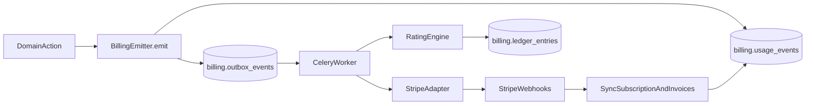

## Goals

- **Reusable module**: billing code and DB objects live in a cohesive `billing` module that can be extracted into another project with minimal changes.
- **DB isolation**: move all billing-related tables into a dedicated Postgres schema (e.g. `billing`) while still supporting tenant RLS.
- **Multiple charging modes**: 
  - **Packages** (subscriptions) with included limits/credits
  - **Pay-as-you-go** (metered usage)
  - **Hybrid** (subscription + overage, or credit packs + usage)
- **Extensible rating**: new billable events can be added with **simple counters** or **weighted formulas** (complexity, tokens, meta fields).
- **Decoupled ingestion**: **DB outbox + Celery worker + Redis** for async processing; producers remain ignorant of Stripe details.

## Current state (what we build on)

- Foundations already exist in public schema via migration `[backend/alembic/versions/0007_tenants_plans_usage.py](backend/alembic/versions/0007_tenants_plans_usage.py)`: `plans`, `subscriptions`, `tenant_modules`, `usage_events`.
- Usage aggregation exists: `[backend/app/services/usage_service.py](backend/app/services/usage_service.py)` and endpoint `[backend/app/api/v1/endpoints/usage.py](backend/app/api/v1/endpoints/usage.py)`. Frontend shows it in Reports: `[frontend/app/(app)/reports/page.tsx](frontend/app/(app)`/reports/page.tsx).
- Tenant RLS relies on `current_setting('app.tenant_id', true)` (see `[backend/alembic/versions/0008_tenant_id_rls.py](backend/alembic/versions/0008_tenant_id_rls.py)`) and tenant context is set via `set_config('app.tenant_id', ...)` in `[backend/app/db/session.py](backend/app/db/session.py)`.

## Architecture (module boundaries)

- **BillingCore (project-agnostic)**
  - DB models (all under `billing` schema)
  - Rating engine (turn usage events + meta into billable units + money)
  - Ledger/invoice domain (immutable ledger entries, invoice lines)
  - Outbox publisher/consumer (transport-agnostic)
- **Adapters (swappable)**
  - `StripeAdapter`: products/prices, customer, subscription, invoices/portal, metered usage sync, webhooks
  - Future: `PayPalAdapter`, etc.
- **Host app integration layer (thin)**
  - Emits usage events from business flows
  - Provides tenant context + auth/RBAC
  - Hosts API routes + UI pages

## Database design (new `billing` schema)

Create schema `billing` and move/replace the existing public billing tables.

### Tables (minimum viable + extensible)

- **Core catalog**
  - `billing.plans` (move from public; keep `module_defaults`, `limits_json`)
  - `billing.plan_prices` (maps internal plan to Stripe price(s); monthly/yearly)
- **Tenant billing state**
  - `billing.subscriptions` (move from public; add provider fields: `provider`, `provider_customer_id`, `provider_subscription_id`, `currency`, `billing_interval`, `trial_ends_at`)
  - `billing.tenant_modules` (move from public; continue gating)
- **Usage**
  - `billing.usage_events` (move from public; keep `event_key`, `quantity`, `meta_json`, `actor_user_id`; add `occurred_at` separate from `created_at`, `idempotency_key`)
  - `billing.meters` (defines event -> unit, aggregation, dimensions)
  - `billing.meter_rates` (per-meter pricing; supports tiers; effective dates)
- **Hybrid / credits**
  - `billing.credit_packs` (SKU definitions)
  - `billing.credit_grants` (tenant purchases/grants; remaining balance)
- **Accounting**
  - `billing.ledger_entries` (immutable: tenant_id, meter/event, units, amount, currency, refs)
  - `billing.invoices` and `billing.invoice_lines` (internal invoice representation; can mirror Stripe invoices)
- **Integration + reliability**
  - `billing.outbox_events` (type, payload_json, status, attempt_count, next_attempt_at, dedupe key)
  - `billing.provider_events` (store Stripe webhook events for idempotency/audit)

### RLS + multitenancy

- Apply the same tenant isolation policy used in `[backend/alembic/versions/0008_tenant_id_rls.py](backend/alembic/versions/0008_tenant_id_rls.py)` to all tenant-scoped billing tables in the `billing` schema.
- Ensure billing writes happen with tenant context already set (as done by `get_db()` in `[backend/app/db/session.py](backend/app/db/session.py)`).

## Rating engine (Cursor-like extensibility)

Introduce a `RatingEngine` that can compute billable units/amount from `(event_key, quantity, meta_json)`.

- **Rule types (safe, declarative)**
  - `simple_count`: amount = quantity * unit_price
  - `sum_meta_field`: amount = meta[field] * unit_price
  - `token_based`: amount = (meta.prompt_tokens + meta.completion_tokens) * price_per_token
  - `complexity_weighted`: amount = quantity * weight(meta) * unit_price
- Store the rule definition in `billing.meters`/`billing.meter_rates` as JSON (validated by Pydantic schema) so adding new events doesn’t require code changes unless you add a new rule type.

## Event ingestion & decoupling (DB outbox + Celery + Redis)

- **Emit**: business code calls `BillingEmitter.emit_usage(...)` which writes `billing.usage_events` + one `billing.outbox_events` row in the same DB transaction.
- **Process**: Celery worker polls `billing.outbox_events` and performs:
  - rating -> ledger entries
  - optional sync to Stripe (metered usage records)
  - invoice rollups (period close)
- **Idempotency**: enforce `idempotency_key` uniqueness per tenant+event to avoid double-charging.

## Stripe integration (v1 adapter)

- **Catalog sync**: map internal `billing.plans` to Stripe Products/Prices (monthly/yearly).
- **Checkout**: create Checkout Session for subscription plan selection.
- **Customer portal**: create Stripe Billing Portal session.
- **Webhooks**: handle subscription changes, invoice paid/failed, checkout completed.
- **Metered usage** (if chosen for pay-as-you-go): send aggregated usage to Stripe periodically; keep provider ids in `billing.subscriptions`.

## Backend API surface

Add a dedicated router (e.g. `/billing`) separate from `/admin`.

- **Tenant-facing**
  - `GET /billing/overview` (current plan, status, next invoice, current period spend)
  - `GET /billing/usage` (Cursor-like breakdown by meter + dimensions)
  - `GET /billing/invoices`
  - `POST /billing/checkout-session` (upgrade/downgrade)
  - `POST /billing/portal-session`
- **Admin (super_admin / billing:manage)**
  - CRUD for meters and rates
  - plan -> price mappings

Keep `/usage/summary` working by re-pointing it to `billing.usage_events`.

## Frontend UI (Cursor-inspired)

Create a dedicated **Billing** section (tenant app), separate from Reports.

- `Billing` page sections
  - Current plan + upgrade CTA
  - “This month’s usage” (meter cards + drilldown)
  - “Spending” (estimated cost now + last invoices)
  - Credits (if enabled)
  - Payment method / Portal link

Reuse existing gating (modules + permissions) used by Reports (`hasModule('billing')` + `billing:read`).

## Implementation sequence (high-level)

1. **Module skeleton**: new `backend/app/modules/billing/` (models, schemas, services, adapters, outbox).
2. **DB migration**: create `billing` schema; create new tables; migrate/alias existing data from public (`plans/subscriptions/tenant_modules/usage_events`).
3. **RLS policies**: add tenant isolation policies for new billing tables (billing schema).
4. **Outbox + Celery**: add Redis service + Celery worker entrypoint; implement reliable outbox processing.
5. **Stripe adapter**: checkout/portal/webhooks; persist provider ids.
6. **Pricing/rating**: meters + rate rules; ledger entries.
7. **APIs + UI**: tenant billing page; admin meter/rate management.
8. **Hardening**: idempotency, retries, webhook signature verification, tests.

## Key files that will change/add

- Backend
  - Add: `backend/app/modules/billing/`** (new)
  - Update: `backend/app/api/v1/endpoints/usage.py` (read from billing schema)
  - Update: `backend/app/services/usage_service.py` (point to new model location)
  - Update: `backend/app/api/v1/endpoints/admin.py` (plan management may move to billing admin router)
  - Add: Alembic revisions under `backend/alembic/versions/` to create/migrate billing schema
  - Update: `backend/requirements.txt` (Stripe SDK, Celery, Redis client)
  - Update: `docker-compose.yml` (add Redis + Celery worker)
- Frontend
  - Add: `frontend/app/(app)/billing/page.tsx`
  - Update: sidebar nav to include Billing link when permitted

## Testing strategy

- Unit tests for rating rules and idempotency.
- Integration tests for outbox processing (event -> ledger -> optional Stripe sync mocked).
- Webhook tests (signature verification, replay/idempotency).

## Notes on reuse

- Keep all billing logic behind a small public interface (e.g. `BillingEmitter`, `BillingQueries`, `BillingAdminService`, `PaymentProviderAdapter`).
- Avoid importing app-specific domain models inside billing core; pass `tenant_id`, `actor_user_id`, and typed `meta` only.
- Store event definitions and pricing rules in DB so other projects can extend without code forks.

